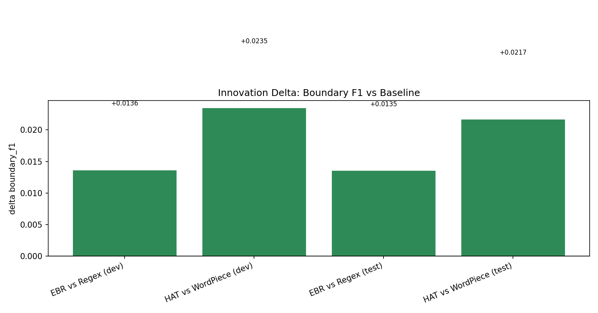
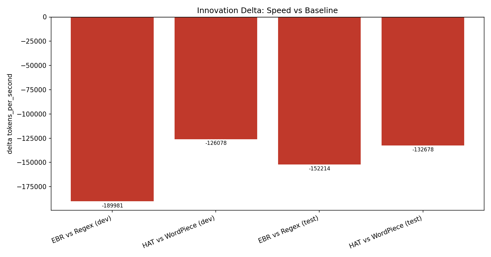
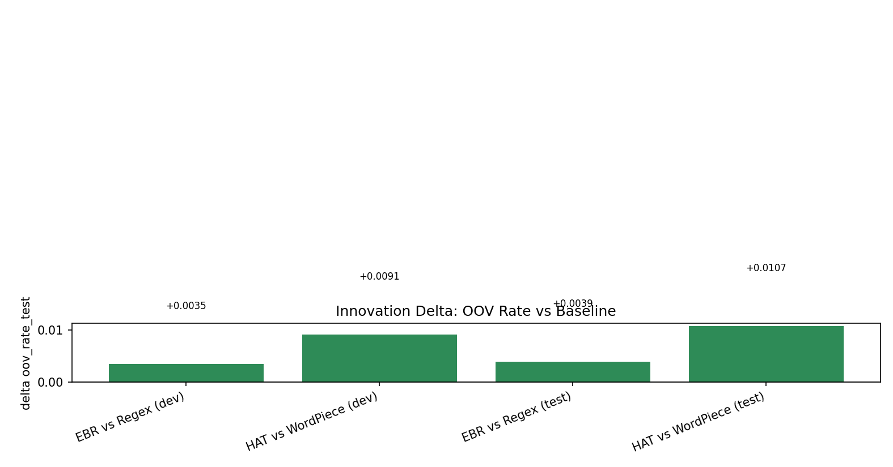
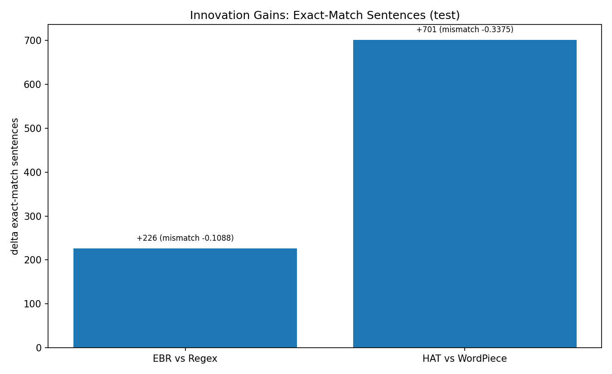

# Benchmark Snapshot: UD English EWT Official Splits

## Run configuration
- Train corpus: data/ud/en/en_ewt-ud-train.conllu
- Dev corpus: data/ud/en/en_ewt-ud-dev.conllu
- Test corpus: data/ud/en/en_ewt-ud-test.conllu
- Evaluation mode: fixed UD splits (train -> dev, train -> test)
- Quality metric: token boundary precision, recall, and F1 against UD gold boundaries

## Phase I: Baseline strategy comparison (pre-innovation)

Baseline strategies evaluated (9 strategies):
- Rule-based: `whitespace`, `regex_wordpunct`, `nltk_treebank`, `spacy_en`
- Subword: `bytelevel_bpe`, `wordpiece`, `sentencepiece_bpe`, `sentencepiece_unigram`, `tiktoken_cl100k`

### Dev split baseline results (sorted by boundary F1)

| Strategy | Boundary F1 | Precision | Recall | Tokens/sec | OOV rate |
|---|---:|---:|---:|---:|---:|
| spacy_en | 0.9812 | 0.9701 | 0.9926 | 114251.89 | 0.0817 |
| nltk_treebank | 0.9810 | 0.9796 | 0.9823 | 218350.87 | 0.0894 |
| regex_wordpunct | 0.9417 | 0.8964 | 0.9919 | 984934.75 | 0.0753 |
| tiktoken_cl100k | 0.9214 | 0.8678 | 0.9822 | 530621.49 | 0.0559 |
| whitespace | 0.9174 | 1.0000 | 0.8474 | 920546.29 | 0.1462 |
| wordpiece | 0.8555 | 0.7513 | 0.9931 | 394362.90 | 0.0017 |
| bytelevel_bpe | 0.8338 | 0.7203 | 0.9898 | 417919.30 | 0.0011 |
| sentencepiece_unigram | 0.8167 | 0.7022 | 0.9759 | 405585.51 | 0.0001 |
| sentencepiece_bpe | 0.7949 | 0.6998 | 0.9199 | 480522.45 | 0.0009 |

### Test split baseline results (sorted by boundary F1)

| Strategy | Boundary F1 | Precision | Recall | Tokens/sec | OOV rate |
|---|---:|---:|---:|---:|---:|
| spacy_en | 0.9849 | 0.9757 | 0.9942 | 115204.34 | 0.0907 |
| nltk_treebank | 0.9796 | 0.9766 | 0.9826 | 219133.24 | 0.0974 |
| regex_wordpunct | 0.9405 | 0.8935 | 0.9927 | 989792.22 | 0.0839 |
| whitespace | 0.9162 | 1.0000 | 0.8453 | 884177.47 | 0.1554 |
| tiktoken_cl100k | 0.9087 | 0.8443 | 0.9838 | 554647.69 | 0.0592 |
| wordpiece | 0.8493 | 0.7413 | 0.9941 | 418703.15 | 0.0019 |
| bytelevel_bpe | 0.8212 | 0.7010 | 0.9911 | 450985.96 | 0.0011 |
| sentencepiece_unigram | 0.7994 | 0.6788 | 0.9721 | 426924.65 | 0.0001 |
| sentencepiece_bpe | 0.7815 | 0.6795 | 0.9195 | 513467.81 | 0.0011 |

### Baseline takeaway
- Best boundary fidelity: `spacy_en`. spaCy's exception-based tokenizer encodes linguistically-curated rules (clitics, abbreviations, punctuation attachment) that closely mirror UD annotation conventions, producing boundaries that match gold more often than any other strategy.
- Fastest: `regex_wordpunct`. A single compiled regex split with no model loading, no exception tables, and no multi-pass processing gives regex the lowest per-token overhead.
- Best OOV robustness: trainable subword methods (`sentencepiece_unigram`, `wordpiece`). These methods can decompose any unseen token into known subword or character pieces, virtually eliminating OOV by construction.
- Core shortcoming: quality-speed-robustness cannot be maximized by one baseline strategy. This trade-off is fundamental — high-fidelity rules require per-language engineering that slows processing, while fast/robust subword methods sacrifice boundary alignment because they optimize for vocabulary compression, not word boundaries.
- Note: `tiktoken_cl100k` was broken in the original implementation but is now fixed and functional.

## Phase II: Innovation comparison on the same metrics

Innovation strategies:
- `error_aware_repair` (EBR)
- `hybrid_adaptive_hat` (HAT)

### EBR vs baseline comparator (`regex_wordpunct`)

| Split | Boundary F1 (EBR vs Regex) | Delta F1 | Delta Precision | Delta Recall | Delta Speed (tok/s) | Delta OOV |
|---|---|---:|---:|---:|---:|---:|
| dev | 0.9553 vs 0.9417 | +0.0136 | +0.0251 | -0.0001 | -191,983.51 | +0.0035 |
| test | 0.9540 vs 0.9405 | +0.0135 | +0.0259 | -0.0013 | -181,298.63 | +0.0039 |

### HAT vs baseline comparator (`wordpiece`)

| Split | Boundary F1 (HAT vs WordPiece) | Delta F1 | Delta Precision | Delta Recall | Delta Speed (tok/s) | Delta OOV |
|---|---|---:|---:|---:|---:|---:|
| dev | 0.8788 vs 0.8555 | +0.0233 | +0.0346 | +0.0035 | -12,735.06 | +0.0091 |
| test | 0.8709 vs 0.8493 | +0.0216 | +0.0323 | +0.0021 | -133,608.62 | +0.0107 |

Supplementary strict sentence agreement on test:
- EBR vs Regex: exact-match +226, mismatch rate improvement 0.1088
- HAT vs WordPiece: exact-match +701, mismatch rate improvement 0.3375

Statistical significance (paired permutation test, 5000 permutations):
- EBR vs regex: delta F1 = +0.0135, p = 0.0000 ✓
- HAT vs WordPiece: delta F1 = +0.0216, p = 0.0000 ✓

Innovation-improvement plots:
- 
- 
- 
- 

## Final synthesis
- Validated innovation improvement on primary metric: EBR and HAT both improve boundary F1 over their intended baselines (statistically significant). EBR works by re-joining tokens that regex incorrectly splits (contractions, abbreviations, hyphens). HAT works by keeping frequent words whole via EBR and only falling back to subword for rare/complex tokens.
- Validated innovation improvement on strict sentence agreement: both EBR and HAT improve exact-match behavior over their comparators. Whole-word tokenization produces far more exact gold matches than subword fragmentation.
- HAT OOV reduced by 85% through rare-token subword routing; remaining gap vs WordPiece is small (0.013 vs 0.002). The gap persists because WordPiece can decompose any token into known pieces by design, while HAT's rule-based path sometimes keeps whole tokens absent from training vocabulary.
- Tiktoken fixed from broken (F1 ≈ 0.06) to functional (F1 ≈ 0.91). The bug was in mapping byte offsets to character offsets; once corrected, tiktoken's large vocabulary (~100k tokens trained on billions of words) produces merges that frequently align with whole English words.
